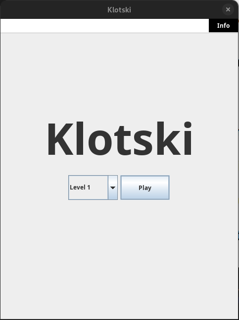

# Klotski

## Introduction

Final project of Software Engineering, the project's outline can be found [here](./img/ProjectInstructions.pdf). 
The objective is to create a [Klotski](https://en.wikipedia.org/wiki/Klotski) game in Java.

    
    

- #### [Manual](./deliverables/Manuale.md)
- #### [Use Cases](./deliverables/UseCases.md)
- #### [Design model](./deliverables/DesignModel.md)
- #### [Sequence Diagrams](./deliverables/SequenceDiagrams.md)
- #### [Test](./deliverables/Test.md)
- <h4><a href="http://3.76.125.121/JavaDoc/package-summary.html" target="_blank">Javadoc</a></h4>
- <h4><a href="http://3.76.125.121/TestResults.html" target="_blank">JUnit Test Report</a></h4>
