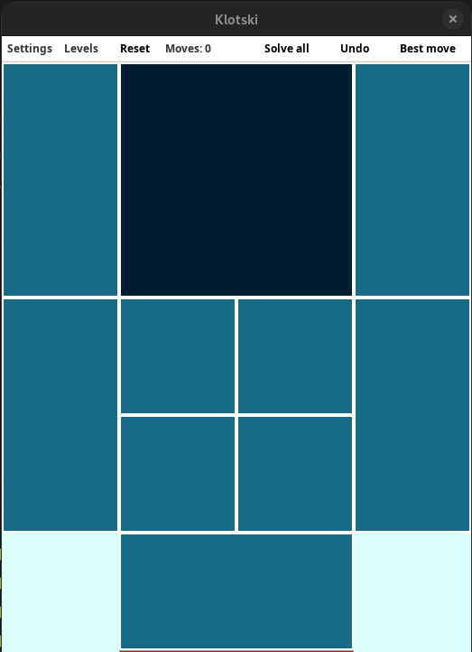

# Klotski

## Introduzione

Progetto finale di ingegneria del software, la traccia del progetto la potete trovare su questa cartella con il nome [TracciaProgetto.pdf](./TracciaProgetto.pdf). L'obbiettivo è di creare il gioco [Klotski](https://en.wikipedia.org/wiki/Klotski) in Java.

<div style="display: flex; justify-content: center;">
    
    
</div>

## Manuale

###  Descrizione del gioco
Klotski é un gioco basato su un’insieme di pezzi disposti su una scacchiera di una certa dimensione e numero di pezzi il cui obiettivo é quello di far “uscire” un pezzo specifico dalla tastiera.

La nostra implementazione di Klotski prevede una tastiera larga quattro caselle e alta cinque, con dieci pezzi disposti su di essa e l’obiettivo finale è quello di far arrivare il piú grande tra di essi nella striscia rossa in fondo alla scacchiera. 

Il programma permette di scegliere tra piú di una disposizione iniziale dei pezzi dal menú principale e anche di mettere “in pausa” la partita salvando la disposizione dei pezzi in un file che sí potrá ricaricare successivamente.

Per rendere meno ostica la risoluzione del puzzle il programma da la possibilitá di conoscere la mossa piú opportuna da effettuare per vincere la partita: il programma collegandosi ad un server esterno riceverá la lista di tutte le mosse necessarie per vincere. É inoltre possibile, tramite il tasto “Undo” di annullare le mosse effettuate precedentemente, di cui il programma tiene traccia.

Lo spostamento delle caselle é effettuato dall’utente trascinando i pezzi con il puntatore del mouse.

### Installazione ed esecuzione
Per eseguire il programma é sufficiente eseguire il file **.jar** distribuito con esso.

### Ambiente di esecuzione
Il programma é stato sviluppato, testato ed eseguito con **Java 11**. Non é stato testato il funzionamento con versioni precedenti o successive del runtim

### Librerie esterne
#### Jackson
**Jackson** é una popolare libreria che permette di gestire file **JSON**. In particolare é servita per salvare lo stato del programma e per comunicare con il solver che gira sotto ambiente Node.JS su un server esterno.

Si mappa il JSON da scrivere/leggere su un oggetto ObjectMapper e successivamente si utilizzano gli oggetti ArrayNode, ObjectNode a seconda dei dati che si vogliono gestire. 

Per esempio la funzione createArrayNode() utilizzata da un oggetto ObjectMapper consente di creare un array che verrá scritto/letto nel JSON. Successivamente si puó creare un oggetto JSON ObjectNode assegnandone il valore dato dal metodo addObject() dell’array, i valori del suddetto oggetto potranno essere modificati tramite il suo metodo put(fieldName, valueName) che permette di scrivere chiave e valore dell’oggetto. Dato che questo oggetto é stato creato a partire da un metodo dell’ArrayNode é giá presente nell’array.

#### HTTPUrlConnection
La libreria consente di gestire connessioni basate sul protocollo **HTTP**. 
In questo programma in particolare é utilizzata per mandare al server esterno una richiesta POST contentente il JSON della disposizione dei pezzi della tastiera che verrá utilizzato dal programma risolutore. 
HTTPUrlConnection si occupa anche di ricevere la risposta del server esterno contenente anch’essa un JSON contenente la lista delle mosse che portano alla vittoria.

```JAVA
HttpURLConnection con = (HttpURLConnection) url.openConnection();
con.setRequestMethod("POST");
con.setDoOutput(true);
con.setRequestProperty("Content-Type", "application/json");
con.setRequestProperty("Accept", "application/json");
```

Questo codice di esempio apre un socket chiamato con che apre la connessione all’url specificato nella variabile url definita in precedenza.
Successivamente definisce una richiesta POST che ha come contenuto un JSON.

Fatto ciò si manda il JSON al server tramite la funzione write() dell’oggetto OutputStream.
Il JSON di risposta del server verrá ricevuto tramite l’istanza di un oggetto di tipo InputStream il cui contenuto verrá letto e scritto in una stringa da un BufferedReader. 

Questa stringa, infine, verrá gestita dalla libreria Jackson per farla diventare un JSON vero e proprio che verrá utilizzato dal programma per suggerire all’utente le mosse da compiere successive.

## Use Cases

## Domain model

## Design model

## Sequence Diagrams

## Test

## Javadoc 