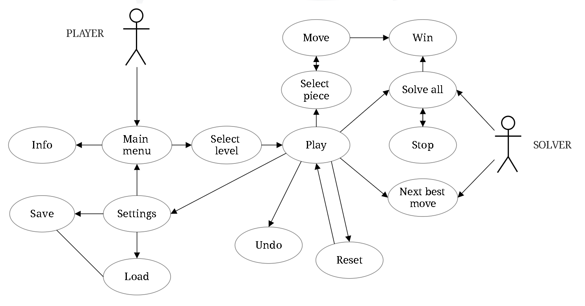

 

| |USE CASE 1 |
| - | - |
|**Name** |Main menu |
|**Actors** |Player |
|**Brief Description** |The Player opens the application. |
|**Preconditions**   |none |
|**Basic flow** |The home screen is displayed and the Player can select a level or read some info about the game before playing it. &nbsp;  &nbsp; &nbsp; &nbsp; &nbsp; &nbsp; |
|**Alternate flows** |none |
|**Postconditions**&nbsp;&nbsp;&nbsp;&nbsp;|Home screen is displayed. |

 

| |USE CASE 2 |
| - | - |
|**Name** |Select Level |
|**Actors** |Player |
|**Brief Description** |The Player chooses one of the 5+1 configurations. |
|**Preconditions** |none |
|**Basic flow** |Player selects one of the 5+1 levels and starts the game (use case #4).  |
|**Alternate flows** |Player doesn’t select a level. Level 1 is selected by default. |
|**Postconditions**&nbsp;&nbsp;&nbsp;&nbsp;|The level selected is displayed. |
|**Note** |The level can also be changed after starting a game (use case #4) clicking the “level” button and choosing one of the 5 options. It equals to starting a new game (use case #4).|

 

| |USE CASE 3 |
| - | - |
|**Name** |Info |
|**Actors** |Player |
|**Brief Description** |Information about the game is displayed. |
|**Preconditions**  |none |
|**Basic flow** |The Player selects “info” and information about the game and it's rules is displayed. &nbsp; &nbsp; &nbsp; &nbsp; &nbsp;&nbsp; &nbsp;&nbsp; &nbsp;&nbsp; &nbsp; &nbsp;&nbsp; &nbsp;&nbsp; &nbsp;&nbsp; &nbsp; &nbsp; &nbsp; &nbsp; &nbsp; &nbsp; &nbsp; &nbsp; &nbsp; &nbsp; &nbsp; &nbsp; &nbsp; &nbsp; &nbsp; &nbsp; &nbsp; &nbsp;|
|**Alternate flows** |none |
|**Postconditions**&nbsp;&nbsp;&nbsp;&nbsp; |none |

 

| |USE CASE 4 |
| - | - |
|**Name** |Play |
|**Actors** |Player |
|**Brief Description** |The Player starts the game. |
|**Preconditions** |none |
|**Basic flow** |A new game starts and the board is displayed. |
|**Alternate flows** |none |
|**Postconditions**&nbsp;&nbsp;&nbsp;&nbsp; |The game board with the selcted configuration is displayed and the Player can move the pieces. &nbsp; &nbsp; &nbsp; &nbsp; &nbsp; &nbsp; &nbsp; &nbsp; &nbsp; &nbsp;&nbsp; &nbsp; &nbsp; &nbsp;&nbsp; &nbsp; &nbsp; &nbsp;&nbsp; &nbsp; &nbsp; &nbsp; &nbsp;|

 

| |USE CASE 5 |
| - | - |
|**Name** |Move |
|**Actors** |Player |
|**Brief Description** |The Player can move the pieces according to the game rules. |
|**Preconditions** |A piece has to be selected. |
|**Basic flow** |The Player drags the pieces to the free spots. |
|**Alternate flows** |The Player tries to drag the blocks outside the board, to move them diagonally or to overlapping them. The piece won’t move in any pf these cases. |
|**Postconditions**&nbsp;&nbsp;&nbsp;&nbsp; |The moves counter increments and now the Player has the opportunity to undo (use case #6). |

 

| |USE CASE 6 |
| - | - |
|**Name** |Undo |
|**Actors** |Player |
|**Brief Description** |Player decides to undo a move. |
|**Preconditions** |The moves counter can’t be 0, at least one move must have been performed. |
|**Basic flow** |The Player undoes the move and the board returns to the previous configuration. |
|**Alternate flows** |Moves counter is 0 and can’t decrement. The board configuration doesn’t change. |
|**Postconditions**&nbsp;&nbsp;&nbsp;&nbsp; |The moves counter decrements by one and the board returns to the previous configuration.&nbsp; &nbsp; &nbsp; &nbsp; &nbsp; &nbsp; &nbsp;&nbsp; &nbsp; &nbsp; &nbsp;&nbsp;&nbsp; &nbsp; &nbsp; &nbsp; &nbsp; &nbsp; &nbsp;&nbsp; &nbsp; &nbsp; &nbsp; &nbsp; &nbsp; &nbsp; &nbsp;&nbsp;|

 

| |USE CASE 7 |
| - | - |
|**Name** |Settings |
|**Actors** |Player |
|**Brief Description** |The Player selects "settings". |
|**Preconditions** |A game must have started (use case #4), can’t do it from the main menu. |
|**Basic flow** |Player selects "settings" and 3 different options are displayed. He can save the game, load a saved one or return to the main menu. |
|**Alternate flows** |Player doesn’t select any of the 3 options. |
|**Postconditions**&nbsp;&nbsp;&nbsp;&nbsp; |Use case #8, #9 or #10. |

 

| |USE CASE 8 |
| - | - |
|**Name** |Save |
|**Actors** |Player |
|**Brief Description** |The current board configuration gets saved. |
|**Preconditions** |Use case #7. |
|**Basic flow** |After making some moves, the Player saves the configuration. |
|**Alternate flows** |The player saves before making any move. That equals to saving the selected configuration. &nbsp; &nbsp; &nbsp;&nbsp;&nbsp; &nbsp; &nbsp;&nbsp;&nbsp; &nbsp; &nbsp;&nbsp; &nbsp; &nbsp; &nbsp;&nbsp;&nbsp; &nbsp; &nbsp;&nbsp;&nbsp; &nbsp; &nbsp;&nbsp; &nbsp; &nbsp; &nbsp; &nbsp; &nbsp; &nbsp;|
|**Postconditions**&nbsp;&nbsp;&nbsp;&nbsp; |The configuration is saved and can be loaded (use case #9). |

 

| |USE CASE 9 |
| - | - |
|**Name** |Load |
|**Actors** |Player |
|**Brief Description** |The saved configuration gets loaded |
|**Preconditions** |Use case #8 and #7. |
|**Basic flow** |Player saves a game, makes some moves and then loads the saving. The saved configuration is displayed and the moves counter changes too. |
|**Alternate flows** |Player tries to load a configuration without saving one before. A message window is displayed. |
|**Postconditions**&nbsp;&nbsp;&nbsp;&nbsp; |The configuration and the moves counter change. |

 

| |USE CASE 10 |
| - | - |
|**Name** |Return to main menu |
|**Actors** |Player |
|**Brief Description** |The Player returns to the home screen using the settings. |
|**Preconditions** |Use case #7 |
|**Basic flow** |The main menu is displayed. The situation is the same one as in use case #1.&nbsp;&nbsp;&nbsp; &nbsp; &nbsp;&nbsp;&nbsp; &nbsp;&nbsp; &nbsp; &nbsp;&nbsp;  &nbsp; &nbsp;&nbsp;  &nbsp; &nbsp;&nbsp;  &nbsp; &nbsp;&nbsp;  &nbsp; &nbsp;&nbsp; &nbsp; &nbsp; &nbsp;&nbsp; &nbsp; &nbsp;&nbsp; &nbsp; &nbsp;&nbsp; &nbsp; &nbsp;&nbsp; &nbsp; &nbsp;&nbsp; &nbsp; &nbsp;&nbsp; &nbsp; &nbsp;&nbsp; &nbsp;|
|**Alternate flows** |none |
|**Postconditions**&nbsp;&nbsp;&nbsp;&nbsp; |Use case #1. |

 

| |USE CASE 11 |
| - | - |
|**Name** |Reset |
|**Actors** |Player |
|**Brief Description** |The Player resets the game|
|**Preconditions** |A game must have started (use case #4) |
|**Basic flow** |After making some moves the Player decides to reset |
|**Alternate flows** |The Player resets the game without making any move, the configuration doesn’t change.|
|**Postconditions**&nbsp;&nbsp;&nbsp;&nbsp; |New game with the same level starts. |
|**Note** |If the player selects the level "random" and resets the game, a new one with a different random configuration will start. &nbsp;|

 

| |USE CASE 12 |
| - | - |
|**Name** |Next best move |
|**Actors** |Player Solver |
|**Brief Description** |The best possible move is performed automatically as asked by the Player. |
|**Preconditions** |Player must be connected to internet. |
|**Basic flow** |The solver performes the best move. |
|**Alternate flows** |none |
|**Postconditions**&nbsp;&nbsp;&nbsp;&nbsp; |The configuration changes and moves counter increments by one. &nbsp; &nbsp; &nbsp; &nbsp; &nbsp; &nbsp; &nbsp; &nbsp; &nbsp; &nbsp; &nbsp; &nbsp; &nbsp; &nbsp; &nbsp; &nbsp; &nbsp; &nbsp; &nbsp; &nbsp; &nbsp; &nbsp; &nbsp; &nbsp; &nbsp; &nbsp; &nbsp; &nbsp; &nbsp; &nbsp; &nbsp; &nbsp; &nbsp; &nbsp; &nbsp; &nbsp; &nbsp; &nbsp; &nbsp; &nbsp; &nbsp; &nbsp; &nbsp; &nbsp; &nbsp; &nbsp; &nbsp;|

 

| |USE CASE 13 |
| - | - |
|**Name** |Solve all |
|**Actors** |Solver |
|**Brief Description** |The game is solved automatically as asked by the Player. |
|**Preconditions** |Player must be connected to interntet. |
|**Basic flow** |The pieces move automatically until the 2x2 square reaches the winning position. &nbsp; &nbsp; &nbsp; &nbsp; &nbsp; &nbsp; &nbsp; &nbsp; &nbsp; &nbsp; &nbsp; &nbsp; &nbsp; &nbsp; &nbsp; &nbsp; &nbsp; &nbsp; &nbsp; &nbsp; &nbsp; &nbsp; &nbsp; &nbsp; &nbsp; &nbsp; &nbsp; &nbsp; &nbsp; &nbsp; &nbsp; &nbsp; &nbsp; &nbsp; |
|**Alternate flows** |The Player stops the Solver (use case #14). |
|**Postconditions**&nbsp;&nbsp;&nbsp;&nbsp; |Win (use case #15). |

 

| |USE CASE 14 |
| - | - |
|**Name** |Stop |
|**Actors** |Player and Solver |
|**Brief Description** |Player stops the automatic solving. |
|**Preconditions** |Use case #13. |
|**Basic flow** |After letting the Solver move some pieces the Player decides to stop it. &nbsp; &nbsp; &nbsp; &nbsp; &nbsp; &nbsp; &nbsp; &nbsp; &nbsp; &nbsp; &nbsp; &nbsp; &nbsp; &nbsp; &nbsp; &nbsp; &nbsp; &nbsp; &nbsp; &nbsp; &nbsp; &nbsp; &nbsp; &nbsp; &nbsp; &nbsp; &nbsp; &nbsp; &nbsp; &nbsp; &nbsp; &nbsp; &nbsp; &nbsp; &nbsp; &nbsp; &nbsp; &nbsp; &nbsp; &nbsp; &nbsp; &nbsp; &nbsp;|
|**Alternate flows** |none |
|**Postconditions**&nbsp;&nbsp;&nbsp;&nbsp; |The Solver stops solving. |

 

| |USE CASE 15 |
| - | - |
|**Name** |Win |
|**Actors** |Player and/or Solver |
|**Brief Description** |Player (or Solver) wins the game |
|**Preconditions** |The 2x2 square is moved to the winning position. |
|**Basic flow** |Player (or Solver) moves the pieces until the 2x2 reaches the winning position. |
|**Alternate flows** |Player isn’t able to make the 2x2 square go to the winning position. |
|**Postconditions**&nbsp;&nbsp;&nbsp;&nbsp; |Restart (same as use case #11) or go back to the main menu  (use case #1).  &nbsp; &nbsp; &nbsp; &nbsp; &nbsp; &nbsp; &nbsp; &nbsp; &nbsp; &nbsp; &nbsp; &nbsp; &nbsp; &nbsp; &nbsp; &nbsp; &nbsp; &nbsp; &nbsp; &nbsp; &nbsp; &nbsp; &nbsp; &nbsp; &nbsp; &nbsp; &nbsp; &nbsp; &nbsp; &nbsp; &nbsp; &nbsp; &nbsp; &nbsp; &nbsp; &nbsp; &nbsp; &nbsp; &nbsp; &nbsp;|
