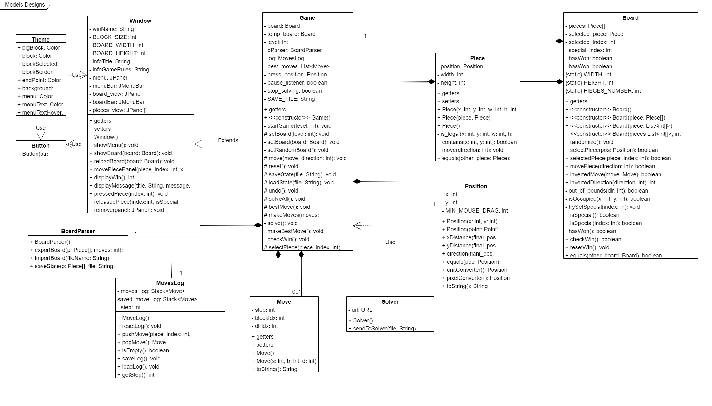

# Desing Model 
Domain model is like a blueprint that helps developers understand and represent the important parts of a problem. It's a way to organize and visualize the key ideas, objects, and relationships within a specific area or field

#### Package design
#### Models design
Is the blueprint of the classes and their organization and communications

#### Views design
#### Controllers design